# Lab9Web
Latihan_9 25-5-2022

## Praktikum 9 PHP Modular
Membuat folder baru dengan nama lab9_php_modular pada docroot webserver (htdocs)
### Header.php
Membuat file header degan kodingan berikut

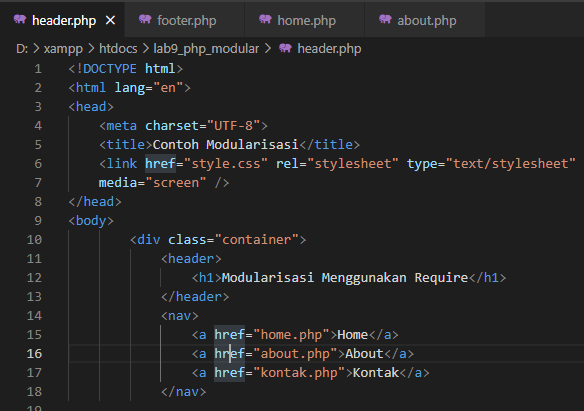

### Footer.php
Membuat file footer dengan kodingan berikut

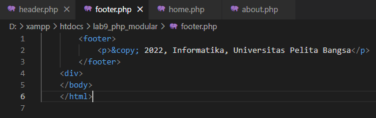

### Home.php
Membuat file home dengan kodingan berikut

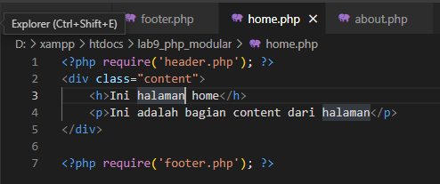

### About.php
Membuat file about dengan kodingan berikut

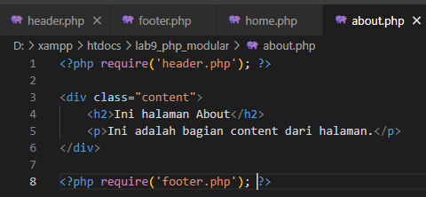

Buka melalui browser http://localhost/lab9_php_modular/home.php, maka tampilan akan seperti ini

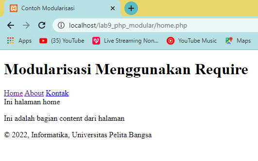

## Pertanyaan dan Tugas
Implementasikan konsep modularisasi pada kode program praktikum 8 tentang
database, sehingga setiap halamannya memiliki template tampilan yang sama.

### Membuat koneksi ke database
Buat file dengan nama `koneksi.php` kemudian masukan kodingan berikut

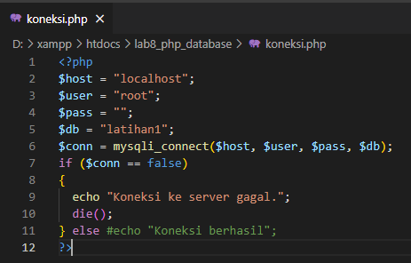

Buka melalui browser untuk menguji koneksi database, jika berhasil maka tampilan seperti ini

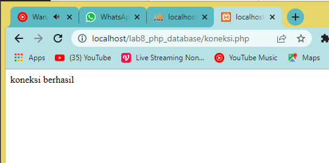

### Header.php
Membuat file `header.php` untuk header di setiap web nya

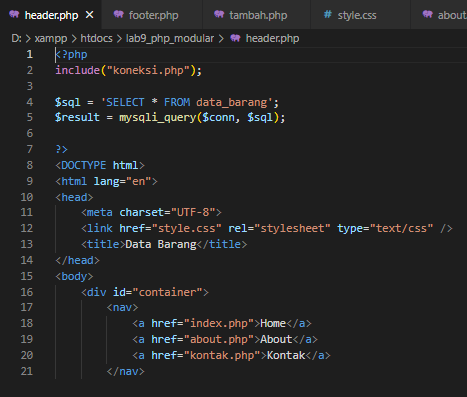

### Footer.php
Membuat file `footer.php` untuk footer disetiap web nya

### Menampilkan data (Read)
Membuat file `index.php` untuk menampilkan data atau read database, kodinganya seperti ini

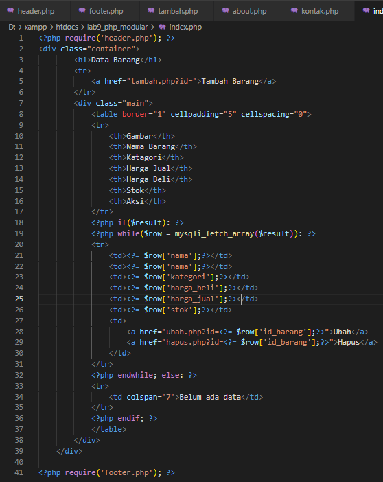

### Menambahkan data (Creat)
Membuat file dengan nama `tambah.php` untuk menambahkan data dan akan masuk ke database

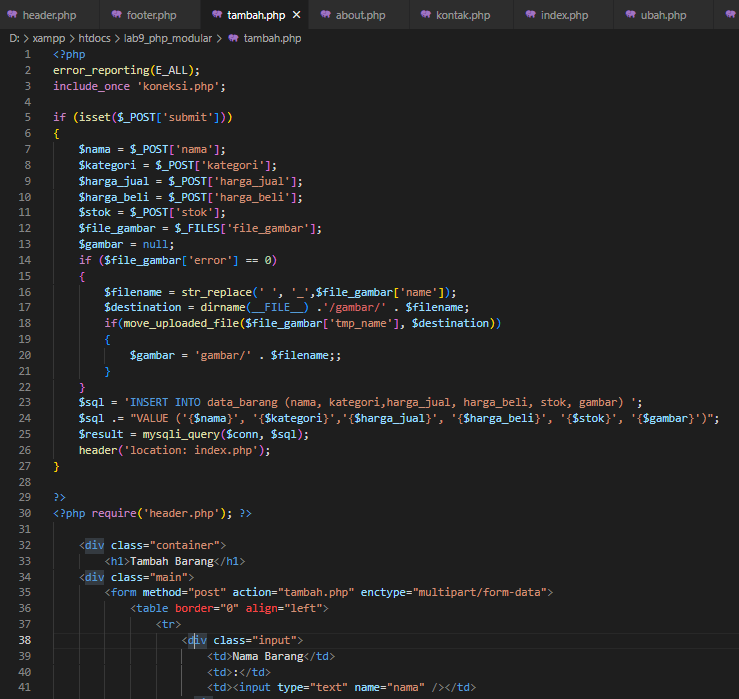
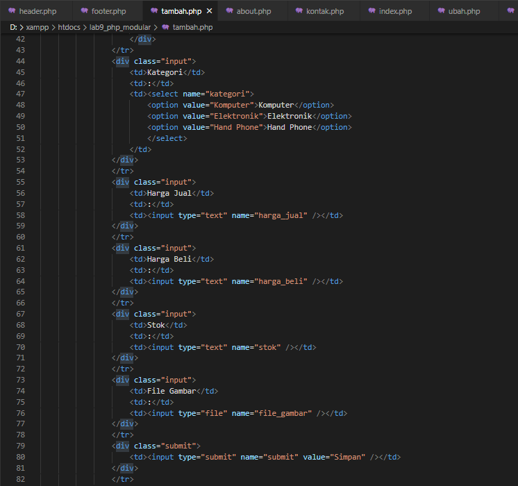
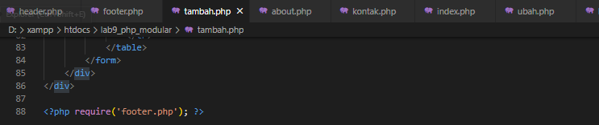

### Mengubah data (Update)
Membuat file dengan nama `ubah.php` untuk mengubah data barang

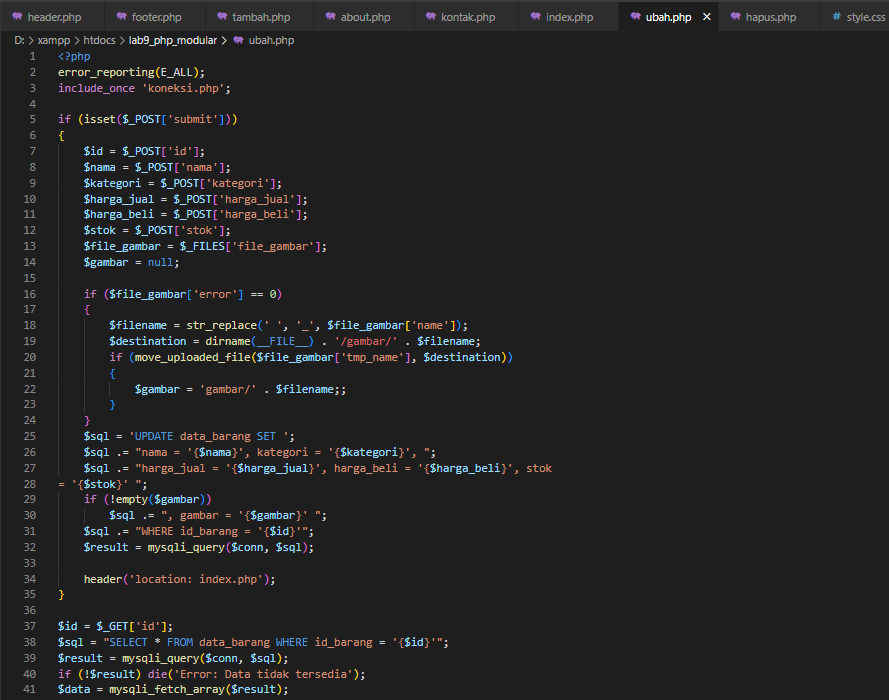
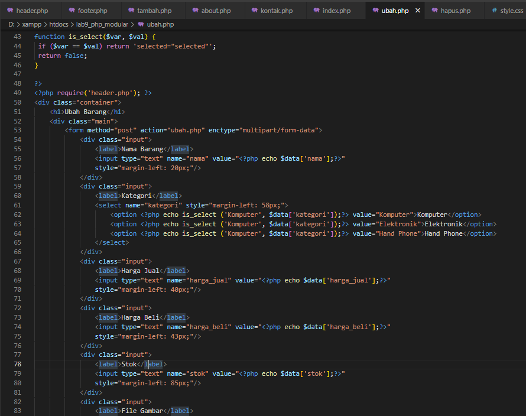
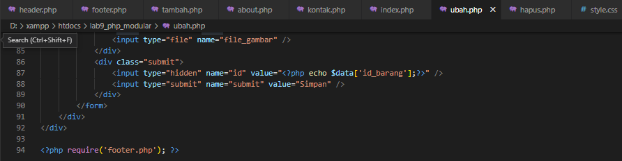

### Menghapus Barang (Delete)
Membuat file dengan nama `hapus.php` untuk menghapus data barang

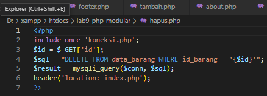

### Deklarasi CSS
Buat file dengan nama `style.css` untuk mengatur tampilan web

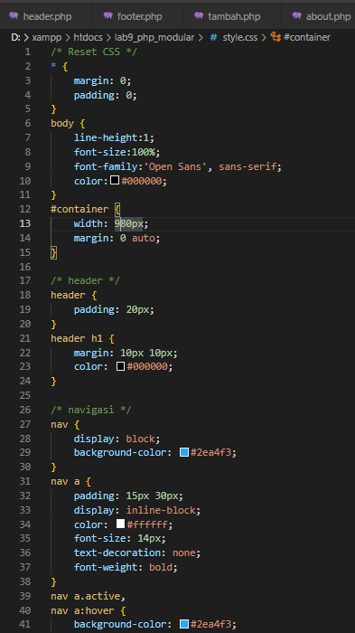
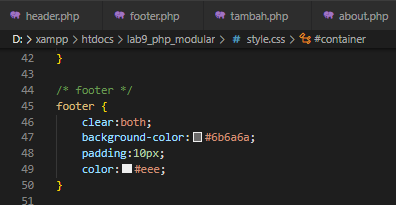

### Tampilan index.php

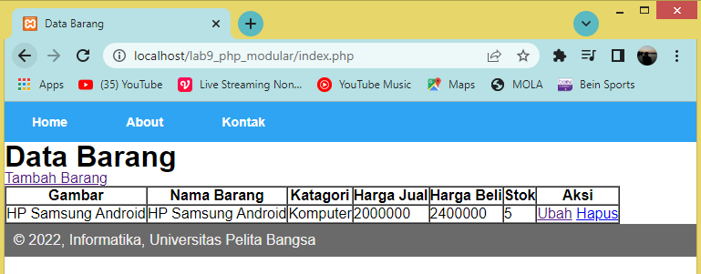

### Tampilan tambah.php

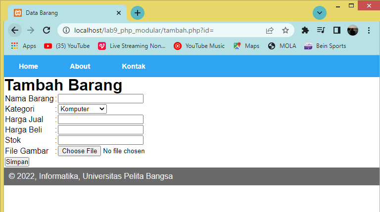

### Tampilan ubah.php

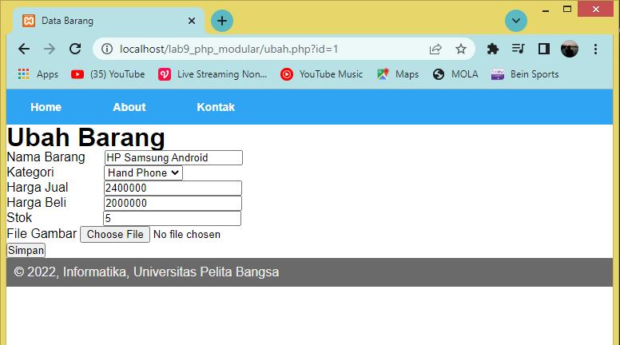

## Praktikum 10: PHP OOP

### Mobil.php
Membuat file baru dengan nama `mobil.php` kemudian masukan kodingan berikut

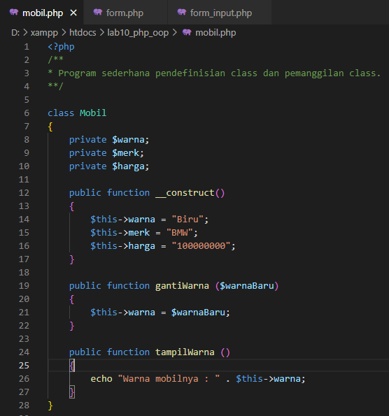
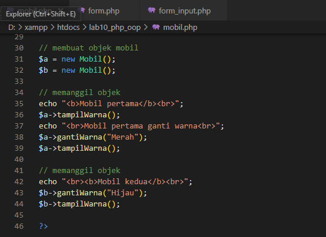

tampilan web nya seperti ini

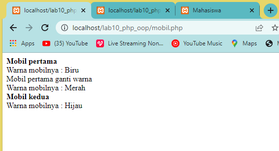

### form.php
Membuat file baru dengan nama `form.php` kemudian masukan kodingan berikut

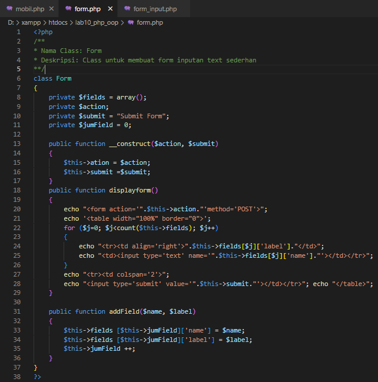

tampilan web nya seperti ini

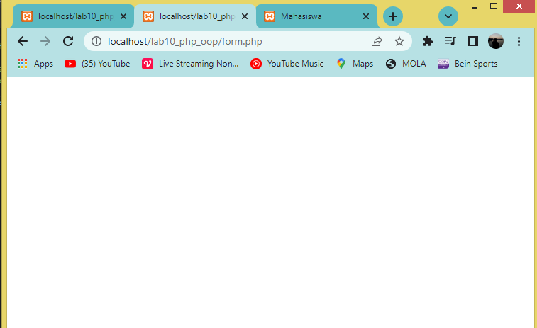

### form_input.php
Membuat file baru dengan nama `form_input.php` kemudian masukan kodingan berikut

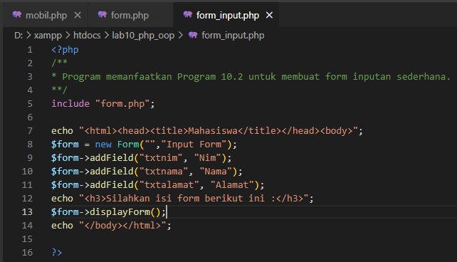

tampilan web nya seperti ini

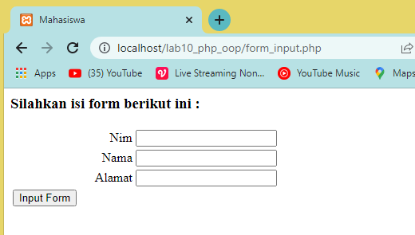